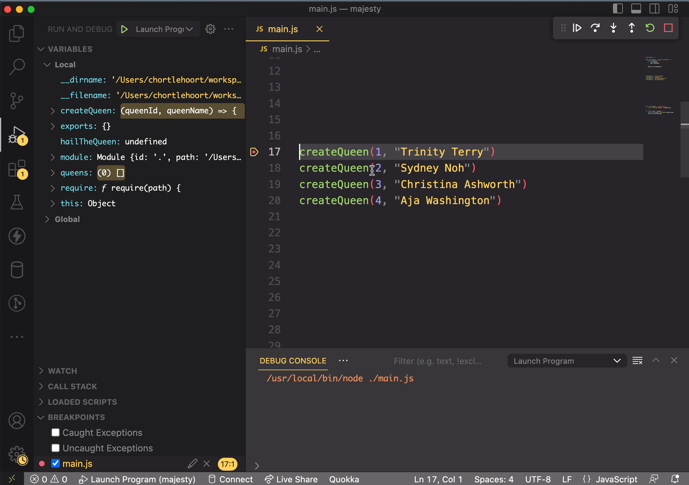

# 5. Queen Colony

In this chapter, you are going to define a new function that will perform the task of adding objects that represent each queen to an array. Thus, you will practice the syntax for arrays and objects that you were introduced to in the Foundations Course.

## Learning Objectives and Competencies

At the end of this chapter you should be able to...

* Create a JavaScript object
* Describe the key names, and corresponding data type of each key's value
* Add a new value to an existing array
* Describe array iteration syntax with correct vocabulary

## Setup

Add the following line of code to the very top of the `main.js`, even before the current function definition.

```js
const queens = []
```

This array, which starts off empty, will contain all of the queens. Each queen will be represented as an object. So far, you have only used strings for the queen's name, but in this chapter, the queen's name will be a property on an object.

## Anoint a Queen

Your job is to write a function that will create an object that represents a queen. Once that object is created, you will use the `.push()` method to add the object to the `queens` array.

Each queen will have two properties.

1. `id` which will be a number that is a unique identifier for each queen.
2. `name` which will be a string value of the queen's name

Here is what the first queen object will look like when you are done.

```js
{
    id: 1,
    name: "Athena Perez"
}
```

The function will need to be given both the unique numerical identifier you want assigned to the queen, and the queen's name. This means that the function must have two parameters defined. The first parameter will capture the number value, and the second parameter will capture the string value.

Here is some starter code. Paste this into your `main.js` module and immediately run it with the debugger. You will be told by JavaScript that there is a syntax error.

Read the stack trace and determine exactly which line of code in your module has the error.

```js
const queens = []

const createQueen = () => {
    const queenObject = {
        id: ,
        name:
    }

    queens.push()
}

createQueen(1, "Trinity Terry")
```

Now try to implement the correct syntax in the function to make it work correctly. There are hints below if you get stuck.

<details>
    <summary>Hint 1 - Parameters</summary>

First define two parameters. You may pick your own variable names if you wish.

```js
const createQueen = (queenId, queenName) => {
    const queenObject = {
        id: ,
        name:
    }

    queens.push()
}
```
</details>

<details>
    <summary>Hint 2 - Key Values</summary>

Assign the value of the parameters to the appropriate keys on the object.

```js
const createQueen = (queenId, queenName) => {
    const queenObject = {
        id: queenId,
        name: queenName
    }

    queens.push()
}
```
</details>

<details>
    <summary>Hint 3 - Push Argument</summary>

Push the value of the `queenObject` variable, which is an object into the array with the `push()` array method.

```js
const createQueen = (queenId, queenName) => {
    const queenObject = {
        id: queenId,
        name: queenName
    }

    queens.push(queenObject)
}
```
</details>

## Watch the Queens Being Created

Now that you have the function working correctly. Invoke the function several times to create multiple queen objects in the array. Then set a breakpoint on the line of code where the function is invoked the very first time and run the debugger again.

Watch the queen array get items added to it as you step over each line of code.


