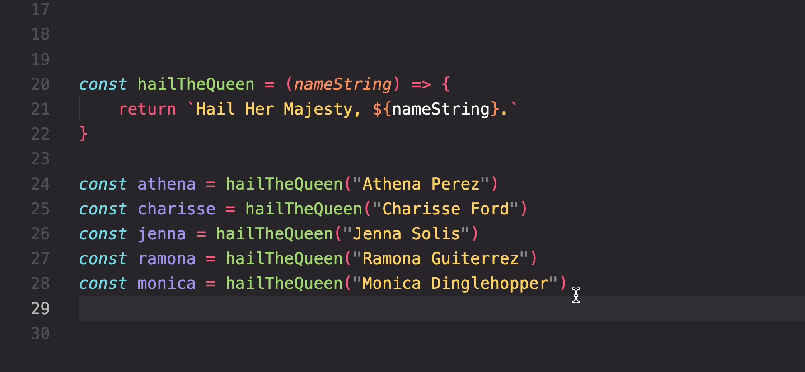

# 6. Iterating the Queens

In this chapter, you are going to iterate the queens array to hail each one.

> Definition of iteration:
>
> To iterate an array means to write code that starts at the first item in the array, then move to each subsequent one until there are no more items in the array.

## Learning Objectives and Competencies

At the end of this chapter you should be able to...

* Write a `for..of` loop to iterate an array
* Describe the syntax of a `for..of` loop correctly
* Step through the code with the debugger and describe the values and scope of variables

## Remove Manual Hails

You are going to automate the hailing of each queen in your array, so the first thing to do is remove all of the invocations of `hailTheQueen()` that you currently have.



## Hail Each Queen

Next, write a `for..of` loop to iterate the `queens` array. Visual Studio Code has a handy helper to write the basic syntax of the loop for you.

Type in `forof` in the editor, and then press your Tab key and you will have some starter code.

Then replace the default variable names it provides with more appropriate variable names.

* The first variable will store each queen object in the array, so `queenObject` would be appropriate
* The second variable must be the one whose value is the array, so this **must** be `queens` because that is what we named our array


The final step is to invoke the hailing function and pass the queen's name to it. This time the syntax will be different for the argument. You won't manually type in the queen's name, since it is already a property of each queen object.

You need to access the correct property on the object inside the parenthesis when the function is invoked. There is a hint below if you can't figure it out with your peers.

```js
for (const queenObject of queens) {

    const hailMessage = hailTheQueen()  // What should be passed as an argument?
    console.log(hailMessage)

}
```

<details>
    <summary>The Answer</summary>


```js
const hailMessage = hailTheQueen(queenObject.name)
```
</details>

## Understand the Flow with the Debugger

Before you move on to the next chapter, put a breakpoint on the very first line of code in the `main.js` module and step through each line of code and follow the flow of logic, and the values of your variables.

This is a top priority skill that you must have as a developer, so skipping this step is folly.

Watch the following video for an overview of using the debugger for this version of your code.

[](https://watch.screencastify.com/v/1sIKYzOFt8qEfrlIic6T)