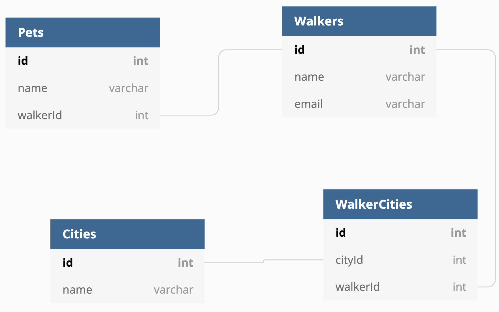

# 7. Servicing Multiple Areas

As DeShawn Dog Walking platform grows in popularity, some of the walkers decide that they want to operate in multiple areas instead of just one. This has a major impact on the data for the project because it changes the relationship between walkers and cities.

Currently there are many walkers, and the city they are assigned to is a property of the walker. The project needs to adapt to allow ambitious walkers to work multiple cities.

Your first insinct would be to change the `city` property of a walker to `cities`, and change its type from `varchar` to `array`.

Unfortunately, nested collections is not supported in the vast majority of database systems that you will use in your career. Therefore, you cannot use that strategy here.

You need to create a new table in your ERD names `Cities` and record all city names in there.

```ddl
Table Cities {
    id int pk
    name varchar
}
```

Then delete the `city` property from the walkers table.

## The Two Questions

How you design the relationship between Walkers and Cities will depend on your answers to the following two questions.

1. Can a walker work in multiple cities?
1. Can a city support more than one walker?

If the answer to 1 was yes, but 2 was no, then the design decision would be to add a `walkerId` propery to the cities table.

If the answer to 1 was no, but 2 was yes, then the design decision would be to add a `cityId` propery to the walkers table.

## Many To Many Relationships

However, the whole point of this chapter is to allow a walker to work multiple cities, and there is no restriction to how many walkers can work in a city.  This means that the answer to **both** of the questions is yes.

1. A walker can work multiple cities.
1. A city can support multiple walkers.

In this case, having a foreign key on the tables themselves is not sufficient. You need a third table to store the many-to-many relationship.

Add the following table to your diagram, and draw the relationships from primary key to foreign key.

```ddl
Table WalkerCities {
    id int pk
    cityId int
    walkerId int
}
```

So a many-to-many relationship is simply two one-to-many relationships that exist on a single table to accomodate a more complex relationship between two resources.



## Starter Relationships

First, remove the `cityId` property from each walker object.

Then copy pasta this data into your `database.js` file to create the required relationships. Notice that San Diego now has three walkers working there, and that Bernie Dreger, Tomlin Cutill, Elmira Bick, and Arv Biddle are now working multiple cities.

> 🛑 **Alert:** As soon as you add this data and refresh your page, you will notice that the assignments at the bottom now display "undefined". This is ok for now. Immediately go to the next chapter to work on the new feature.

```js
    walkerCities: [
        { id: 1, walkerId: 10, cityId: 1 },
        { id: 2, walkerId: 8, cityId: 6 },
        { id: 3, walkerId: 5, cityId: 4 },
        { id: 4, walkerId: 9, cityId: 10 },
        { id: 5, walkerId: 2, cityId: 3 },
        { id: 6, walkerId: 4, cityId: 7 },
        { id: 7, walkerId: 1, cityId: 5 },
        { id: 8, walkerId: 7, cityId: 9 },
        { id: 9, walkerId: 3, cityId: 2 },
        { id: 10, walkerId: 6, cityId: 8 },
        { id: 11, walkerId: 6, cityId: 9 },
        { id: 12, walkerId: 9, cityId: 7 },
        { id: 13, walkerId: 5, cityId: 7 },
        { id: 14, walkerId: 10, cityId: 2 },
    ],
    cities: [
        { id: 1, name: "Pittsburgh"},
        { id: 2, name: "Minneapolis"},
        { id: 3, name: "Phoenix"},
        { id: 4, name: "Tucson"},
        { id: 5, name: "Denver"},
        { id: 6, name: "Boise"},
        { id: 7, name: "San Diego"},
        { id: 8, name: "Sarasota"},
        { id: 9, name: "White Plains"},
        { id: 10, name: "Chicago"}
    ],
```

